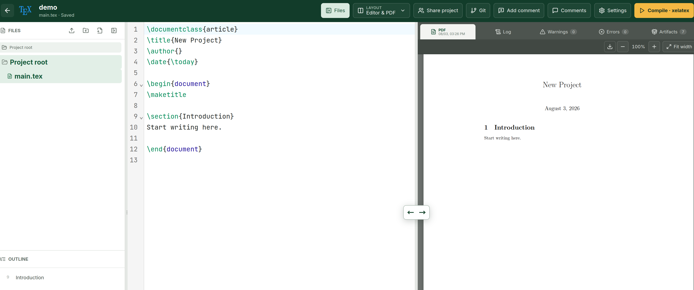

# texLite

texLite is a lightweight, local-first web workspace for writing, compiling, previewing, and discussing LaTeX documents. It is intended for a small group of trusted users on one server. It uses the LaTeX installation already available on the host instead of shipping a LaTeX container, and keeps the rest of the stack deliberately small.

**Documentation:** English (this file) · [Design](DESIGN.md) · [简体中文](README.zh-CN.md)

**Website:** [TexLite GitHub Pages](https://swufe-db-group.github.io/TexLite/)

For design goals, architecture, collaboration and compilation behavior, history,
navigation and diagnostics, GitHub backup, and data-management decisions, see
[DESIGN.md](DESIGN.md).

## Requirements

- Node.js 24 or newer
- npm
- git (optional; required only for the project-owner Git/GitHub integration)
- latexmk
- At least one configured engine: pdflatex, xelatex, or lualatex

Check the host before initialization:

~~~bash
node --version
npm --version
latexmk --version
xelatex --version
# Optional, when Git/GitHub integration is needed:
git --version
~~~

npm run init and application startup check latexmk and every engine in latex.allowedEngines. Git is deliberately excluded from this core check, so a host without Git can initialize and run TexLite normally. When a project owner opens the Git panel or invokes a Git/GitHub operation, TexLite checks git.binary on demand and shows an actionable error if Git is unavailable.

Formatting is optional and runs in the browser. TexLite bundles the [`tex-fmt` npm package](https://www.npmjs.com/package/tex-fmt) (a WASM build) for `.tex`, `.cls`, and `.sty` files, and uses browser-side `bibtex-tidy` for `.bib` files. The editor settings panel accepts per-user/per-project TOML options for `tex-fmt`; no host formatter installation or PATH configuration is required.

## Quick start

### Global npm installation

The published package provides a `texlite` executable. It keeps configuration
and project data outside the global npm installation:

~~~bash
npm install --global texlite
texlite init
texlite start
texlite status
~~~

Open http://127.0.0.1:3000. The service can be stopped or restarted from any
working directory:

~~~bash
texlite stop
texlite restart
texlite logs
~~~

The default configuration is
`$XDG_CONFIG_HOME/texlite/texlite.config.json`, or
`~/.config/texlite/texlite.config.json` when `XDG_CONFIG_HOME` is not set. The
default data directory is `$XDG_DATA_HOME/texlite`, or
`~/.local/share/texlite`. Use `--config PATH` or `TEXLITE_CONFIG` to select a
different configuration file.

`texlite serve` runs the server in the foreground and is suitable for Docker,
systemd, and debugging. `start`, `status`, `stop`, `restart`, and `logs` use the
PM2 dependency bundled with the package. Managed startup waits until the HTTP
health endpoint is ready; `status` reports `unhealthy` if PM2 is running but the
managed process is not actually serving TexLite. `restart` recreates the PM2
entry so npm upgrades always use the current package paths and environment.
Failed startup attempts are bounded instead of entering an unlimited restart
loop.

For a clean upgrade:

~~~bash
npm update --global texlite
texlite restart
~~~

Uninstalling the npm package does not remove the configuration or project data:

~~~bash
npm uninstall --global texlite
~~~

### Repository/source installation

~~~bash
npm ci
cp texlite.config.example.json texlite.config.json
export TEXLITE_CONFIG="$PWD/texlite.config.json"
# Edit texlite.config.json if needed.
npm run init
npm run build
npm start
~~~

The default server binds to localhost and does not expose public registration.
The initialization command asks for the first administrator account; the server
refuses to start until at least one active administrator exists.

For a non-interactive initialization, set the following environment variables for that command only:

~~~bash
TEXLITE_INIT_USERNAME=admin \
TEXLITE_INIT_DISPLAY_NAME=Administrator \
TEXLITE_INIT_PASSWORD='use-a-password-of-at-least-8-characters' \
npm run init
~~~

Avoid putting the password in shell history on a shared machine.

## Development and verification

Run the API/server watcher and Vite in separate terminals:

~~~bash
npm run dev       # API and server at http://127.0.0.1:3000
npm run dev:web   # Vite UI at http://127.0.0.1:5173
~~~

Vite proxies /api requests to the server. Before a production-style run, use:

~~~bash
npm run typecheck
npm test
npm run build
npm start
~~~

## Configuration

Configuration path precedence is:

1. `--config PATH` passed to the `texlite` executable;
2. `TEXLITE_CONFIG`;
3. `$XDG_CONFIG_HOME/texlite/texlite.config.json`;
4. `~/.config/texlite/texlite.config.json`.

Relative paths in the configuration are resolved relative to that configuration
file. `storage.dataDir` defaults to `$XDG_DATA_HOME/texlite`, or
`~/.local/share/texlite`. Set `storage.dataDir` in the configuration, or use
`TEXLITE_DATA_DIR`, to choose another data directory. The production client
bundle defaults to the `dist/client` directory inside the installed package;
`TEXLITE_CLIENT_DIR` can override it for development or custom deployments.

The example configuration is intentionally complete:

~~~json
{
  "siteName": "TexLite",
  "adminEmail": "admin@example.com",
  "sessionDays": 14,
  "server": { "host": "127.0.0.1", "port": 3000 },
  "storage": { "dataDir": ".texlite" },
  "uploads": { "maxFileSizeMB": 50 },
  "pdf": { "loadingStrategy": "auto", "rangeThresholdMB": 5 },
  "history": { "maxVersions": 200, "maxStorageMB": 128 },
  "git": {
    "binary": "git",
    "operationTimeoutSeconds": 120,
    "githubApiBaseUrl": "https://api.github.com"
  },
  "latex": {
    "latexmk": "latexmk",
    "defaultEngine": "xelatex",
    "allowedEngines": ["pdflatex", "xelatex", "lualatex"],
    "extraArgs": [],
    "allowProjectLatexmkrc": true,
    "compileTimeoutSeconds": 600,
    "maxCompileJobs": 10
  }
}
~~~

The checked-in example uses `.texlite` as an explicit repository-development
path. A configuration generated by `texlite init` uses the XDG data directory
default described above instead.

Important settings:

- server.host and server.port: network bind address and port. Keep the host at 127.0.0.1 unless a separately secured deployment is intended.
- storage.dataDir: SQLite database, project sources, compile output, and the Git token encryption key.
- uploads.maxFileSizeMB: maximum size for a project upload, a ZIP entry, project files, and attachments. The default is 50 MB.
- pdf.loadingStrategy: PDF.js transfer mode: `auto`, `full`, or `range`. In `auto` mode, PDFs at or below `pdf.rangeThresholdMB` use one cache-friendly response; larger PDFs use byte-range requests.
- pdf.rangeThresholdMB: automatic Range threshold, defaulting to 5 MB. This is a deployment-level preview setting, not a project compiler option.
- history.maxVersions: maximum number of ordinary, unlabeled versions retained per project. Initial and labeled versions are protected.
- history.maxStorageMB: soft per-project limit for deduplicated history objects. The oldest ordinary versions are removed first; protected versions and the current internal baseline can exceed this limit.
- latex.defaultEngine, latex.allowedEngines, latex.extraArgs: compile choices available in the UI.
- latex.compileTimeoutSeconds: timeout for one compile job.
- latex.maxCompileJobs: global number of concurrent LaTeX processes. Jobs for the same project and root document are serialized; newer source versions supersede older queued requests. Different root documents use independent workspaces and may compile concurrently within this global limit.
- Compilation copies a short-lived immutable source snapshot, then runs `latexmk` outside the ordinary project-operation queue. Editing and retained-PDF reads can continue; Git checkout, history restore, deletion, and compile-cache cleanup wait for active compilation to finish.
- latex.allowProjectLatexmkrc: allow a project to supply a multi-line latexmkrc. A project rc file is executable Perl configuration and should only be enabled for trusted users.

Before every compile TexLite passes `-norc` to latexmk. Therefore a `.latexmkrc`
included directly in an uploaded ZIP, Git checkout, or project source is ignored.
The file is read only when the owner explicitly selects it in Project Settings,
where TexLite passes it with `-r`.

### Effective defaults and startup validation

When a setting is omitted, texLite uses the following built-in defaults (the
generated example file may choose to show an explicit value such as an admin
email):

| Setting | Effective default |
| --- | --- |
| `siteName` | `TexLite` |
| `adminEmail` | empty |
| `server.host` / `server.port` | `127.0.0.1` / `3000` |
| `storage.dataDir` | `$XDG_DATA_HOME/texlite` or `~/.local/share/texlite` |
| `clientDir` | `dist/client` inside the installed package |
| `sessionDays` | `14` |
| `uploads.maxFileSizeMB` | `50` MB |
| `pdf.loadingStrategy` | `auto` |
| `pdf.rangeThresholdMB` | `5` MB |
| `history.maxVersions` | `200` ordinary versions per project |
| `history.maxStorageMB` | `128` MB per project (soft limit) |
| `latex.latexmk` | `latexmk` |
| `latex.defaultEngine` | `xelatex` |
| `latex.allowedEngines` | `pdflatex`, `xelatex`, `lualatex` |
| `latex.extraArgs` | `[]` |
| `latex.allowProjectLatexmkrc` | `true` |
| `latex.compileTimeoutSeconds` | `600` seconds |
| `latex.maxCompileJobs` | `10` |
| `git.binary` / `git.operationTimeoutSeconds` | `git` / `120` seconds |
| `git.githubApiBaseUrl` | `https://api.github.com` |

Configuration is validated before environment checks, database opening, or
the HTTP listener starts. Explicit values are never silently replaced by a
default. The accepted ranges are: port `1–65535`, sessions `1–3650` days,
upload size `1–2048` MB, history versions `10–5000`, history storage
`16–102400` MB, PDF Range threshold `1–2048` MB, compile timeout `1–3600` seconds, compile jobs `1–32`,
and Git timeout `1–3600` seconds. Engine names must be supported, unique, and
the allowed-engine list must include the selected default engine. Data and
project paths must not point at files (the data directory cannot be the
filesystem root); a missing data directory must have an existing writable
parent. The GitHub API endpoint must be an `http://` or `https://` URL.

Invalid JSON types, empty required strings, malformed integers (including
decimal or non-numeric environment overrides), unsupported engines, invalid
URLs, and unusable paths stop startup with the setting name, expected value,
and a remediation hint. The same validation runs during `npm run init`, so a
configuration can be checked before creating the first administrator.

Environment variables override the corresponding file values:

~~~text
TEXLITE_CONFIG
XDG_CONFIG_HOME                 XDG_DATA_HOME
TEXLITE_SITE_NAME             TEXLITE_ADMIN_EMAIL
TEXLITE_HOST                  TEXLITE_PORT
TEXLITE_DATA_DIR              TEXLITE_CLIENT_DIR
TEXLITE_SESSION_DAYS          TEXLITE_MAX_UPLOAD_SIZE_MB
TEXLITE_PDF_LOADING_STRATEGY TEXLITE_PDF_RANGE_THRESHOLD_MB
TEXLITE_HISTORY_MAX_VERSIONS TEXLITE_HISTORY_MAX_STORAGE_MB
TEXLITE_LATEXMK               TEXLITE_DEFAULT_ENGINE
TEXLITE_COMPILE_TIMEOUT       TEXLITE_MAX_COMPILE_JOBS
TEXLITE_GIT                   TEXLITE_GIT_TIMEOUT
TEXLITE_GITHUB_API_URL
~~~

texLite does not run tlmgr or install missing packages. Updating TeX Live on the host changes the environment used by the next compile.

## Service management

For a global npm installation, the lifecycle commands use the bundled PM2
runtime. No separate global PM2 installation is needed:

~~~bash
texlite start
texlite status
texlite logs
texlite restart
texlite stop
~~~

`texlite status` uses a colored, systemctl-style terminal view. Use
`texlite status --json` for scripts and monitoring integrations.

`texlite doctor` validates configuration, paths, LaTeX, and the administrator;
add `--git` to check the optional Git integration. `texlite config` prints the
effective paths and values. `texlite serve` keeps the process in the foreground
and does not start PM2.

Repository deployment with a separately installed PM2

For repository deployments, `ecosystem.config.cjs` and the npm PM2 wrappers are
also available. It deliberately runs one forked instance (`instances: 1`);
cluster mode is not supported because collaboration state, the compile queue,
SQLite, and the project filesystem are local to one process.

~~~bash
npm install --global pm2
npm run build
pm2 start ecosystem.config.cjs
pm2 status
pm2 logs texlite
~~~

The repository wrappers are `npm run pm2:start`, `npm run pm2:restart`,
`npm run pm2:stop`, `npm run pm2:delete`, `npm run pm2:logs`, and
`npm run pm2:save`.

After deploying new code:

~~~bash
npm run build
pm2 restart texlite --update-env
~~~

To keep the process across reboots, run the command printed by pm2 startup, then save the process list:

~~~bash
pm2 save
~~~

Useful lifecycle commands are pm2 stop texlite, pm2 restart texlite, pm2 delete texlite, and pm2 monit.

## Security boundaries

texLite is designed for trusted users on localhost. The default compiler disables shell escape, does not concatenate shell commands, and enforces compile timeouts and concurrency limits. Nevertheless, LaTeX itself and a project latexmkrc are not a security sandbox. Before exposing texLite to an untrusted network or public registration, add an isolated compiler sandbox and an appropriate authentication/reverse-proxy layer.

## License and status

texLite is licensed under the GNU Affero General Public License v3.0. See [LICENSE](LICENSE). If you need proprietary modifications or commercial terms different from AGPL-3.0, contact the copyright holder for a separate commercial license.

This repository is an early, single-host application rather than a drop-in replacement for Overleaf. Review and adapt the deployment, backup, and security settings for the environment in which it will run.
