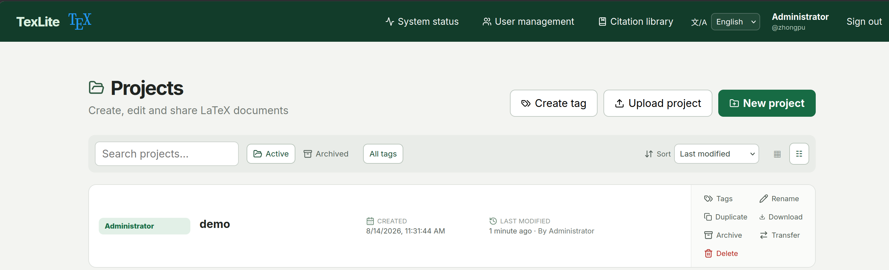
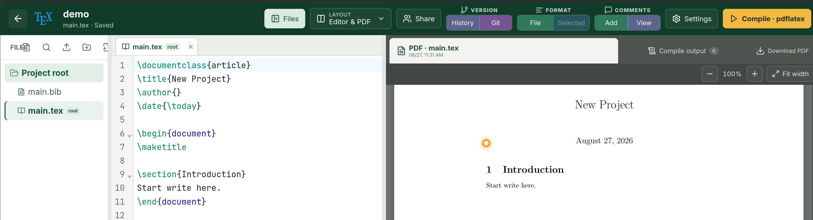

# TexLite

A lightweight self-hosted alternative to Overleaf for _small, trusted_ research
teams. Use your existing LaTeX distribution, with no heavyweight service stack.

[](https://github.com/SWUFE-DB-Group/TexLite/actions/workflows/ci.yml)
[](https://www.npmjs.com/package/texlite)
[](https://hub.docker.com/r/zhongpu/texlite)

**Documentation:** English (this file) · [Operations](OPERATIONS.md) · [Design](DESIGN.md) · [简体中文](README.zh-CN.md)

**Website:** [TexLite GitHub Pages](https://swufe-db-group.github.io/TexLite/)




## Why TexLite

- **Own the writing environment.** Use the host's TeX installation and keep
  sources, history, and compiled output in one local data directory.
- **Collaborate without a large stack.** The default deployment is one Node.js
  process, SQLite, and local files—plus real-time editing and source-level
  comments for a small trusted team.

## A practical distinction from Overleaf

[Overleaf](https://www.overleaf.com/about/features-overview) is a strong choice
when its hosted product or broader ecosystem is the right fit. TexLite addresses
a narrower self-hosted use case:

- A shared hosted service can queue, slow down, or time out at usage peaks.
- Overleaf's open-source [Community Edition](https://github.com/overleaf/overleaf)
  follows a more involved [Docker deployment path](https://docs.overleaf.com/on-premises/getting-started/what-is-the-overleaf-toolkit), and
  several functionalities, such as source comments, are [Server Pro features](https://docs.overleaf.com/on-premises/user-and-project-management/roles-and-permissions).
  *If you do not mind a heftier Docker image, [we have one ready too](#docker-deployment) :)*

Self-hosting does not make every document compile faster: that still depends on
the host and the document. It does give the team control over capacity, TeX
updates, data location, and the collaboration workflow.

For a desktop-first, individual workflow, start with
[VS Code + LaTeX Workshop](https://github.com/James-Yu/LaTeX-Workshop) or
[TeXstudio](https://texstudio.org/) instead. TexLite is purpose-built for
shared browser writing, not a replacement for a personal IDE.

## What the writing workflow includes

- Projects with folders, ZIP import/export, tags, sharing, ownership transfer,
  archiving, and a private per-user citation library.
- CodeMirror editing with LaTeX/BibTeX highlighting, folding, completion,
  optional Vim mode, formatting, spelling/grammar assistance, search/replace,
  and source/PDF SyncTeX navigation.
- Yjs-based collaborative source editing, active-session presence, comments
  anchored to source text, replies, resolution, and permissions that let
  reviewers comment without changing source.
- `latexmk` compilation with selectable engines, project settings, structured
  diagnostics, cached successful PDFs, downloadable artifacts, and optional
  project-level `latexmkrc`.
- Per-project history and owner-only Git/GitHub backup. Git is optional and is
  checked only when its integration is used.

## Quick start

Install Node.js 24 or newer, `latexmk`, and at least one TeX engine such as
`pdflatex`, `xelatex`, or `lualatex`. Git is needed only for the optional
Git/GitHub integration.

After installation, `texlite requirements` checks the relevant host software
and versions before initialization.

```bash
npm install --global texlite
texlite requirements
texlite init
texlite start
texlite status
```

Open <http://127.0.0.1:3000>. `texlite init` creates the configuration and the
first administrator; public registration is deliberately unavailable.

For upgrades and routine management:

```bash
npm update --global texlite
texlite restart
texlite logs
```

`texlite serve` runs in the foreground for debugging, Docker, or systemd.
`start`, `stop`, `restart`, `status`, and `logs` use the PM2 runtime bundled
with the npm package. Run `texlite help` for the complete command list.

<a id="docker-deployment"></a>

### Docker deployment

If the host does not have—or you do not want to maintain—Node.js, TeX Live,
Git, and Harper locally, use the heavier
[TexLite-Docker](https://github.com/SWUFE-DB-Group/TexLite-Docker) deployment.
Its published image bundles those runtime dependencies for you.

```bash
git clone https://github.com/SWUFE-DB-Group/TexLite-Docker.git
cd texlite-docker
cp deployment.example.json deployment.json
# Edit deployment.json before the first start.
./scripts/compose.sh pull
./scripts/compose.sh up -d
```

See the [TexLite-Docker README](https://github.com/SWUFE-DB-Group/TexLite-Docker#readme)
for its user-facing configuration and operations guide.

## Documentation map

| Need                                                                                                                               | Read                                                       |
| ---------------------------------------------------------------------------------------------------------------------------------- | ---------------------------------------------------------- |
| Installation, configuration paths, effective defaults, environment overrides, service management, backups, and security boundaries | [Operations guide](OPERATIONS.md)                          |
| Collaboration, source persistence, compilation isolation, history, and design trade-offs                                           | [Design](DESIGN.md)                                        |
| Testing an npm package before publication                                                                                          | [NPM testing guide](NPM_TESTING.md)                        |
| Complete configuration starting point                                                                                              | [texlite.config.example.json](texlite.config.example.json) |

## Scope and security

TexLite is a single-host application for trusted users. It is not a compiler
sandbox: LaTeX and an enabled project `latexmkrc` can execute powerful local
behaviour. Keep the default `127.0.0.1` bind unless you add the authentication,
network controls, and isolated compiler environment appropriate for an
untrusted deployment.

## License

TexLite is licensed under the GNU Affero General Public License v3.0; see
[LICENSE](LICENSE). For proprietary modifications or commercial terms that
differ from AGPL-3.0, contact the copyright holder.
